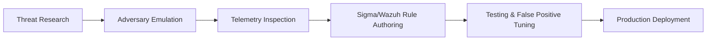

# 🎯 Detection Engineering & Rule Repository

This directory houses high-fidelity detection rules developed during the lab, mapped to **MITRE ATT&CK** techniques.

---

## 📐 Rule Frameworks Supported

1. **Sigma Rules** (`detections/sigma/`): Generic YAML detection signatures convertible to Wazuh, Splunk, Sentinel, and Elastic.
2. **Wazuh XML Rules** (`detections/wazuh/`): Native Wazuh rules leveraging Sysmon event channel fields and XML decoders.

---

## 🧪 Rule Validation Lifecycle

